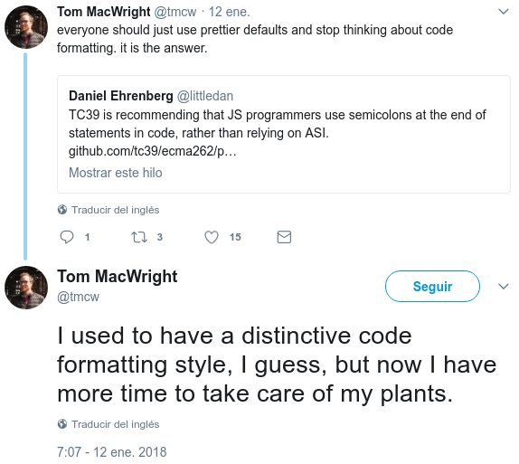

# Estilo de código

"Estilo de Código" es un término que puede tener un mayor o menor alcance según quien lo use. Puede definir desde las normas de arquitectura de la aplicación y como debemos nombrar los ficheros hasta si debemos usar tabuladores o espacios. En este texto hablamos de lo último, nos referimos únicamente a la "apariencia" del código y reservamos términos como "coding conventions", "arquitectura", para el resto de conceptos.

Hay un acuerdo común en que fijar una guía de estilo y que el equipo use prácticas uniformes en la base de código es positivo. Las estilo concreto a usar, las herramientas, ... son objeto de numerosos _flames_ y cada proyecto y equipo tiende a discutir intensamente porqué "x" es mejor que "y".

En la versión inicial de este documento se recogían frases como esta:

> Hay muchas formas de fijar estas convenciones, pero el hacerlo paso a paso, empezando por lo pequeño y que las decisiones sean lo más unánimes posibles es la mejor forma a largo plazo.

o párrafos como este:

> ## Porqué que es útil discutir de Tabuladores y Espacios
>
> Mucha gente opina que decisiones como el estilo de código debería tomarlas el CTO en una hora o usar los defaults de las herramientas y concentrarse en lo importante, que es construír el producto.
>
> El argumento tiene lógica, pero hay dos réplicas a ello. La primera es que [unos estilos son mejores que otros](http://conocimientoabierto.es/charlas-programming-style-douglas-crockford/909/).
>
> La segunda es que discutir de tabuladores y espacios es ~~importante~~ útil. Por mucho scrum y mucha [retro](https://www.mountaingoatsoftware.com/agile/scrum/meetings/sprint-retrospective), generar el clima de confianza adecuado para cagarse en el facilitador o que los nóveles opinen si se debe usar una [arquitectura hexagonal](http://alistair.cockburn.us/Hexagonal+architecture) es difícil. Discutir sobre el color del [cobertizo para bicicletas](http://producingoss.com/en/common-pitfalls.html#bikeshed), en algunos contextos será una perdida de tiempo y energía. En otros será una buena actividad, un ejercicio práctico antes de elevar el nivel de abstracción de las discusiones.
>
> Y en todo caso, es algo que hay que decidir, así que mejor que sea por [consenso](https://lasindias.blog/4-ideas-sencillas-para-llevar-a-tu-comunidad-al-consenso).

Tras dedicar bastantes horas a esto, opinamos que los primeros estás más cerca de la "verdad". [Citando a Tom MacWright](https://twitter.com/tmcw/status/951697210860650496)

Si tuvieramos que comenzar el proceso de nuevo estos serían nuestros pasos:

1.  Documentarse brevemente sobre porqué es útil tener una guía de estilo de código
2.  Revisar brevemente algunas de las guías publicadas y los estilos de proyectos de éxito
3.  Probar algunas de los herramientas disponibles
4.  Discutir en el equipo los hallazgos
5.  Fundamentalmente. Definir el objetivo de la guía de estilo y los **principios**. Nos permitirán tomar decisiones más rápido y objetivizarlas
6.  Documentar e implementar
7.  Si es necesario iterar. Y en todo caso ser pragmáticos

## Principios

Nuestros principios, en orden de importancia son:

1.  Evitar bugs
2.  Aumentar la legibilidad
3.  Mejorar la eficiencia del desarrollo
    1.  El estilo debe ser validable automáticamente
    2.  El estilo debe ser aplicable automáticamente
4.  Mejorar el rendimiento y consumo de recursos (de la aplicación)

Nos pasamos más tiempo depurando, navegando y leyendo código que escribiéndolo.

El consumo de recursos excesivo o el mal rendimiento se mide a posteriori. Por supuesto entre usar una `lista` o un `iterador` en general usaremos un `iterador`. Pero esto es un problema de conocimientos, _code review_ y linting, más que de estilo.

Si bien suele ser fácil reconocer un código como malo o ilegible, lo contrario no es tan fácil. En palabras de (Tom MacWright)[https://macwright.org/2018/02/08/advice-to-the-newish-programmer.html]

> But readable or elegant is, more than anything else, in the eye of the beholder.
> And generally, it’s meaningless

Lo que significa volviendo al pragmatismo, que se puede pensar que las comillas simples quedan más bonitas que las dobles. Pero decir que son más legibles es poco realista. Si una herramienta automatiza un estilo consistente de comillas, usaremos el propuesta por la herramienta frente a elecciones personales.

Como toda guía de estilo, este documento es subjetivo. Tratamos de razonar nuestras decisiones y las expresamos de forma categórica. Esto no tiene necesariamente que significar que creamos que tu estilo sea malo. Pero nosotros tenemos el nuestro. Cuando trabajemos en tu código seguiremos tus reglas, porque la consistencia importa. Pero, cuando trabajes con el nuestro, respeta nuestras reglas.

## Curiosidades y otras observaciones

### Potenciamos el uso de Linters o de Formatters

Formatter.

Si bien en nuestro principios la legibilidad tiene más valor que la "velocidad", seguir unas reglas rígidas no debe ser una molestia. Programar ya es lo bastante complicado como para ver decenas de marcadores rojos por usar dos espacios en lugar de cuatro o porqué falta un intro en algún sitio.

Va a depender del workflow de cada equipo, y de como cada persona se sienta cómoda, pero en todo caso, lo que nunca debería pasar es estar perdiendo tiempo, corrigiendo "problemas" de estilo a mano.

Las reglas que sean claramente estilísticas sólo deberían ser errores durante la escritura de código si su corrección puede automatizarse. Puede ser conveniente, mantener dos configuraciones para el linter, una sin errores de estilo, y otra para ser lanzada en un hook de git o en el ci.

### Por qué "a veces" si hay que activar las reglas de estilo del linter

Como reflexión, puede haber equipos (o personas) a las que les interese correr las reglas de linting de estilo durante el desarrollo, antes de que el formatter haga su trabajo. O incluso en el caso de herramientas no-opininativas como `yapf` forzar "código feo".

Por ejemplo seteando un en `yapf` el knob `align_closing_bracket_with_visual_indent = false` y en `flake8` activando la regla `E124`.

Esto generará código horrible en algunos casos. Puede parecer contraproducente. Pero:

-   Los formatters no son magia. Simplemente siguen una heurística programada por un ser humano que no puede contemplar todas las situaciones. Y tienen bugs.
-   Que un if con cinco `or`, tres `and` y cuatro llamadas a funciones sea partido en varias líneas, no significa que sea legible. Pero el formatter hará eso y el linter no saltará.
-   A veces el código feo, es la única forma de que quien lo escribe, se de cuenta de que el problema es otro y use algún "refactor de libro".

## Contribuciones

En el momento en que un equipo o proyecto (especialmente si es de Software Libre) fije unas determinadas reglas de estilo, hay que ser explicito sobre lo que se espera al respecto. Si es obligatorio que todos las contribuciones de código lo cumplan, si es sólo una recomendación, que herramientas se deben usar, ... 

Y por supuesto dar guías sencillas de como instalar o usar las herramientas necesarías.

Un fichero de `CONTRIBUTING.md` en la raíz del proyecto es uno los sitios adecuados para estas descripciones.

## Referencias

-   <https://www.smashingmagazine.com/2012/10/why-coding-style-matters/>
-   **Douglas Crockford. Programming Style & Your brain**. YUIConf 2011. 66'. <https://www.youtube.com/watch?v=taaEzHI9xyY>
    En esta charla Crockford explica lo importante que es usar un estilo de código adecuado, y como hay estilos mejores que otros (según el lenguaje que estemos usando). Al programar no debemos tratar de demostrar lo listos que somos, si no escribir código para que otros puedan entenderlo, y hay estilos que favorecen esto además de reducir los bugs que podamos cometer. La charla se centra en Javascript y la herramienta JSLint, pero el porqué de usar un estilo y herramientas es importante vale para cualquier lenguaje.
-   <https://news.ycombinator.com/item?id=19289782>
