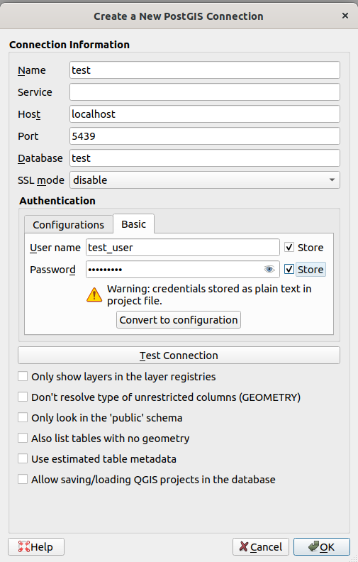
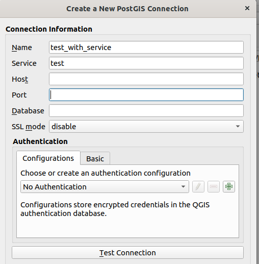

# Crear un proyecto compartible de QGIS con conexiones a PostgreSQL/PostGIS

La mayoría de veces que se crea un proyecto de QGIS con capas en PostgreSQL/PostGIS se hace escribiendo directamente los datos de la conexión, lo que incluye almacenar la contraseña en texto claro en el proyecto.



Cuando se hace de este modo dentro del .qgz/.qgs del proyecto habrá una línea como esta:

```
<datasource>dbname='test' host=localhost port=5439 user='test_user' password='test_user' sslmode=disable key='id' srid=4326 type=Point checkPrimaryKeyUnicity='0' table="public"."cities" (geom)</datasource>
```

Esto genera muchos problemas a la hora de pasar el proyecto "a producción" o compartirlo con otras personas:

* Los usuarios y contraseñas deben ser compartidos entre varias personas, con lo que no se pueden establecer permisos individuales o grupales de una forma lógica.
* Si no _hardcodeamos_ el usuario y la contraseña cada persona que use el proyecto tendrá que introducir cada vez los datos.
* Las contraseñas se almacenan en texto claro
* Si hay que cambiar el servidor por ejemplo para pasar del entorno de test al de producción, hay que modificar el proyecto.
* ...

Si bien hay algunas formas de mejorar un poco esto, usar `.pgpass`, usar el [Authentication Manager](https://docs.qgis.org/latest/en/docs/user_manual/auth_system/auth_overview.html), usar algún script a medida empotrado en el proyecto, ... no son la mejor opción y [tienen problemas](https://gis.stackexchange.com/questions/247454).

La mejor forma, por decirlo de alguna forma, asociar los datos de conexión a un nombre, y [en QGIS establecer la conexión](https://gis.stackexchange.com/questions/393485) mediante ese nombre.

PostgreSQL permite hacer esto mediante el [Connection Service File](https://www.postgresql.org/docs/12/libpq-pgservice.html). Un fichero de texto ubicado en Linux en `~/.pg_service.conf` y en Windows en `%APPDATA%\postgresql\.pg_service.conf` que tendría un aspecto como este:

```
[test]
host=localhost
port=5439
dbname=test
user=test_user
password=test_user
sslmode=disable

# Avoid hardcode the password in prod
[production]
host=my.production.server
port=5432
dbname=my_project
user=my_user
```

Y en QGIS se establecería la conexión así:



Donde sólo es necesario rellenar el nombre de la conexión y el nombre del servicio (el texto entre corchetes) del fichero `.pg_service.conf`. Esto está explicado con más detalle en la [documentación de QGIS](https://docs.qgis.org/latest/en/docs/user_manual/managing_data_source/opening_data.html#creating-a-stored-connection).

Las ventajas de usar conexiones con nombre son claras y resuelven los problemas mencionados arriba. Una persona puede preparar el proyecto en local, cuando pasa a producción sólo tiene que enviar el proyecto, indicar el nombre de la conexión y los parámetros a rellenar en el `.pg_service.conf`

Además dado que este fichero es gestionado directamente por [libpq](https://www.postgresql.org/docs/current/libpq.html), la librería estándar de cliente para conectar a PostgreSQL que usan el 99% de las aplicaciones esta estrategia funcionará con cualquier aplicación, no sólo QGIS.

Por ejemplo en comandos de consola:

```shell
ogrinfo PG:"service=test" cities
psql service=test
```

o en scripts de QGIS:

```python
layer = QgsVectorLayer("service=test table=cities (geom)", "Cities", "postgres")
QgsProject.instance().addMapLayer(layer)
```

En el Service File se pueden definir un [montón de parámetros](https://www.postgresql.org/docs/12/libpq-connect.html#LIBPQ-PARAMKEYWORDS) y pocos son obligatorios. Por ejemplo si no definimos la contraseña cualquier aplicación que use `libpq` _workflow_ normal para descubrir el _password_: variable `PGPASSWORD`, fichero `.pgpass`, preguntar a la persona.

Referencias

* https://www.opengis.ch/2024/05/28/the-postgresql-connection-service-file-and-why-we-love-it/