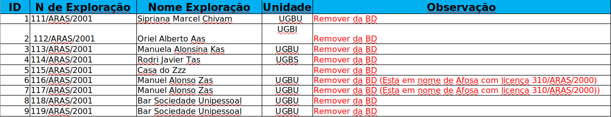
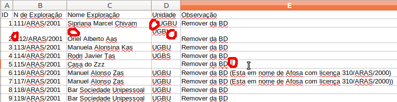
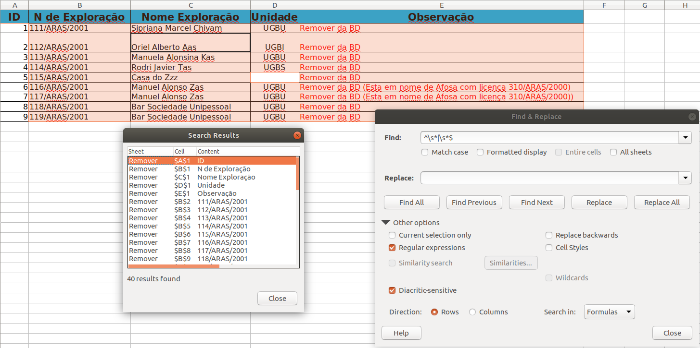

# Eliminar espacios sobrantes en hojas de cálculo

Un problema habitual al trabajar con hojas de cálculo, que se empleen para algún procesado posterior es el de introducir espacios en blanco sobrantes al principio o al final del texto de interés. A esta situación se le suele denominar "leading spaces" o "trailing spaces"

Consideramos espacio sobrantes a la aparición de sólo uno " " o varios seguidos " " de los siguientes caracteres:

-   Espacio. ` `
-   Tabuladores. `\t`
-   Saltos de línea en cualquiera de sus formas: `\n`, `\r\n`, ...

Si bien en algunas situaciones la existencia de estos espacios no tiene importancia en otras si la tiene. Imaginemos que una celda de la hoja de cálculo contiene algún "identificador" en formato texto, [or ejempo un NIF](https://generadordni.es/#dni) como "48847196A" que usaremos para enlazar con otra hoja, o para subir a una base de datos. Si al teclear o trabajar con el NIF hemos introducido algún espacio, quedando la celda de esta forma "48847196A " ese código no enlazará con los existentes.

Si bien hay distintas estrategias para revisar esta situación en una hoja de cálculo lo más sencillo, es por defecto, cuando finalicemos el trabajo grueso de edición y cada vez que vayamos a usar esa hoja de cálculo para una fase posterior de trabajo o enviarlo a otra persona eliminemos todos estos espacios.

A continuación mostramos un ejemplo. Si bien a primera vista se pueden apreciar algunos de los errores



Si examinamos la versión en csv vemos que hay más de los que se pueden explorar a simple vista:

```csv
ID,N de Exploração,Nome Exploração,Unidade,Observação
1,111/ARAS/2001 ,Sipriana Marcel Chivam,   UGBU,Remover da BD
2, 112/ARAS/2001 ,Oriel Alberto Aas,"UGBI
",Remover da BD
3,113/ARAS/2001,Manuela Alonsina Kas,UGBU,Remover da BD
4,114/ARAS/2001,Rodri Javier Tas ,UGBS,Remover da BD
5,115/ARAS/2001 ,Casa do Zzz ,,Remover da BD  
6,116/ARAS/2001 ,Manuel Alonso Zas,UGBU,Remover da BD (Esta em nome de Afosa com licença 310/ARAS/2000)
7,117/ARAS/2001,Manuel Alonso Zas,UGBU,Remover da BD (Esta em nome de Afosa com licença 310/ARAS/2000))
8,118/ARAS/2001,Bar Sociedade Unipessoal ,UGBU,Remover da BD
9,119/ARAS/2001,Bar Sociedade Unipessoal ,UGBU,Remover da BD
```

En la siguiente imagen identificamos con círculos rojos todos los errores de este tipo:



-   En D1, tenemos dos espacios al inicio del código
-   En B2, tenemos un espacio al inicio del código
-   En C2, tenemos un salto de línea al inicio del nombre
-   En D2, tenemos un salto de línea tras la unidad
-   En E5, tenemos varios espacios en blanco al final del comentario

Eliminar todos los espacios en una sóla operación en Excel no es del todo sencillo sin la ayuda de complementos. En los siguientes enlaces se exponen algunas posibilidades:

-   [How To Remove Leading And Trailing Spaces In Excel Cells?](https://www.extendoffice.com/documents/excel/667-excel-remove-first-space.html)
-   [How to remove spaces in Excel - leading, trailing, non-breaking](https://www.ablebits.com/office-addins-blog/2016/11/23/remove-spaces-excel/)

La forma más rápida y seguramente también la más sencilla de eliminar estos espacios de toda la hoja al mismo tiempo es usando la utilidad de `Edit -> Find & Replace` de _LibreOffice Calc_.

Asegurándonos de que no tenemos ninguna fila o columna seleccionada lanzamos la herramienta de "Find & Replace":

-   En "Find", introduciremos el siguiente texto: `^\s*|\s*$`
-   El valor de "Replace" lo dejaremos en blanco
-   Pulsamos en "Other Options" y marcamos "Regular Expressions"
-   Pulsamos en "Replace All". Confirmamos y cerramos las distintas ventanas



Con esto habremos eliminado todos los "leading and trailing whitespaces", quedando el csv resultante con este aspecto:

```csv
ID,N de Exploração,Nome Exploração,Unidade,Observação
1,111/ARAS/2001,Sipriana Marcel Chivam,UGBU,Remover da BD
2,112/ARAS/2001,Oriel Alberto Aas,UGBI,Remover da BD
3,113/ARAS/2001,Manuela Alonsina Kas,UGBU,Remover da BD
4,114/ARAS/2001,Rodri Javier Tas,UGBS,Remover da BD
5,115/ARAS/2001,Casa do Zzz,,Remover da BD
6,116/ARAS/2001,Manuel Alonso Zas,UGBU,Remover da BD (Esta em nome de Afosa com licença 310/ARAS/2000)
7,117/ARAS/2001,Manuel Alonso Zas,UGBU,Remover da BD (Esta em nome de Afosa com licença 310/ARAS/2000))
8,118/ARAS/2001,Bar Sociedade Unipessoal,UGBU,Remover da BD
9,119/ARAS/2001,Bar Sociedade Unipessoal,UGBU,Remover da BD
```

El texto que hemos introducido en la casilla de "Find" es lo que se denomina una [expresión regular](https://regex101.com/). En esta en concreto lo que estamos haciendo es:

-   `^`. Busca sólo textos que empiecen del modo que te indico a continuación
-   `\s`. Ese modo son "whitespaces": espacios, tabuladores y saltos de línea
-   `*`. Y quiero que busques cualquier número de ellos (0 o más) que estén seguidos
-   `|`. Y además quiero que busques otro patrón distinto "OR"
-   `\s*$`. Que serán whitespaces que se encuentren al final `$` de la línea
