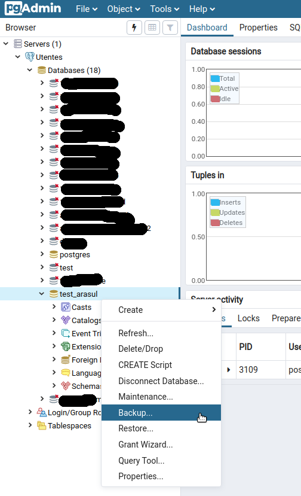
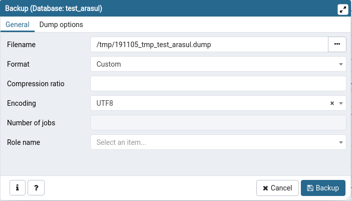
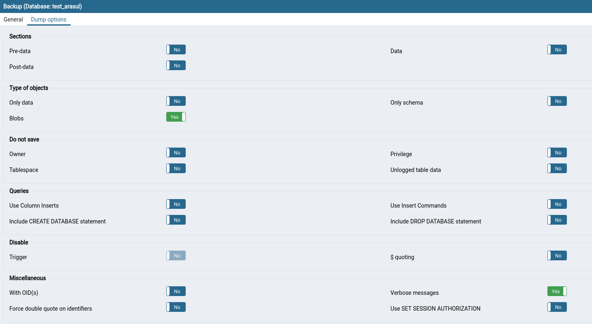
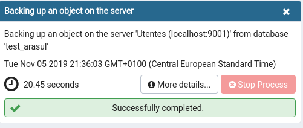

# Dump de una base de datos con pgAdmin 4

_Nota: Actualizado a Noviembre/2019. pgAdmin 4.13_

Llamamos `dump` a exportar una base de datos a un fichero. Los motivos para realizar un `dump` son variados pero generalmente son uno de los siguientes:

-   Realizar una copia de seguridad
-   Poder "enviar" la base de datos a otra persona

Según que herramientas y parámetros se empleen para realizar el `dump` este fichero puede contener:

-   Los usuarios de la base de datos y sus permisos
-   El "continente" o esquema de la base de datos
-   El "contenido" o los datos en sí almacenados

O una combinación de cualquiera de los puntos anteriores.

A continuación se describen los pasos y algunos de los parámetros de configuración para hacer un `dump` del esquema y de los datos.

## Lanzar el diálogo de Backup

En pgAdmin desplegamos la lista de bases de datos, pinchamos con el botón derecho sobre el nombre de la que queremos exportar y pulsamos en `Backup...`. En este ejemplo estaríamos exportando la base de datos llamada `test_arasul`

## Parámetros generales del dump

En la primera pestaña (`General`) del diálogo de Backup escogemos las opciones más importantes:

-   Filename: Pinchando en los "..." podremos escoger el directorio de nuestro disco duro y el nombre del fichero en el que exportaremos la base de datos. Es recomendable seguir una nomenclatura uniforme para nombrar estos ficheros. Por ejemplo: `YYMMDD_tmp_NOMBRE_BD.dump`, que en nuestro caso quedaría como `191105_tmp_test_arasul.dump`. pgAdmin nos permite usar cualquier extensión para el nombre del fichero. Nuestra recomendación es usar `.sql` cuando se escoja `Plain` en el tipo de formato y `.dump` cuando se escoja `Custom`.
-   Format: La explicación de los formatos está en la [documentación de pg_dump](https://www.postgresql.org/docs/current/app-pgdump.html). `Plain` significa que la exportación se realizará como un fichero de texto plano donde se escribirán las sentencias SQL que permiten "recrear" la base de datos. `Custom` es un formato binario y comprimido que pueden leer herramientas específicas como el propio pgAdmin (a través de pg_restore). La opción recomendada es `Custom`.
-   Encoding: Específica que "encoding" (juego de caracteres) se empleará para crear el dump. Si se deja en blanco lo creará en el `encoding` en que está definida la base de datos. La recomendación es dejarlo en blanco o bien usar `UTF-8`.
-   Resto de opciones: La recomendación es dejarlas en blanco.

## Otras opciones del dump

La pestaña `Dump options` nos da opciones adicionales a la hora de configurar el dump:

-   Sections: Dejaremos todas las opciones como `No`
-   Type of objects. Marcaremos `Blobs` como `Yes`. Si marcamos `Only Data` como `Yes` únicamente se exportaran los datos en sí y no el esquema de la base de datos. Si marcamos `Only Schema` como `Yes` sólo se exportará el esquema y no los datos. Dejaremos tanto `Only Data` como `Only Schema` a `No`.
-   Do not save: `Owner` hace referencia a si queremos guardar en el dump al propietarios de los objetos que exportemos (tablas, funciones, ...). De la misma forma `Privileges` indica si queremos exportar los permisos sobre los objetos. Dejaremos todas las opciones a `No` indicando que **si** queremos exportar los permisos. En algunas situaciones (al usar el dump como un fichero de intercambio) puede complicar la restauración, pero es posible restaurarlo igual, así que es mejor guardar la mayor cantidad de información posible.
-   Queries. No tiene importancia cuando usamos el formato `Custom`.
-   El resto de opciones también las dejaremos como aparecen por defecto.

## Backup y errores

Al pulsar en el botón de `backup` se cerrará el diálogo y a los pocos segundos aparecerá una barra de progreso. Cuando se complete el fichero estará listo. Si aparece algún error podemos pulsar en "More details" y copiar el contenido de esa ventana a un documento que enviar a alguien que nos pueda ayudar a resolver el problema.

